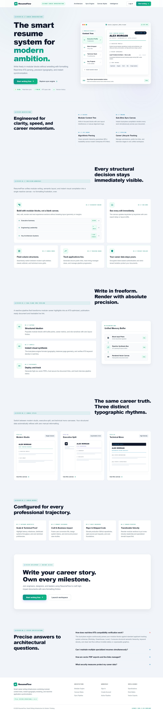
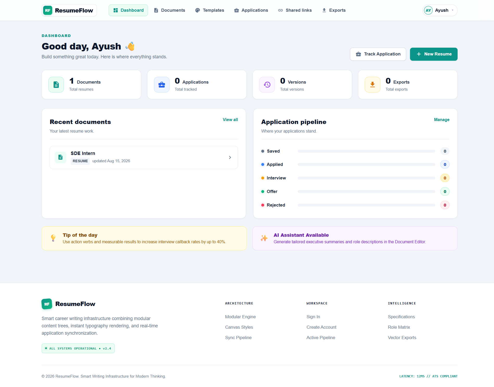
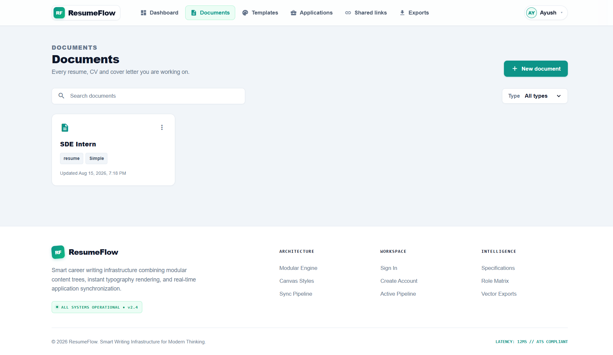
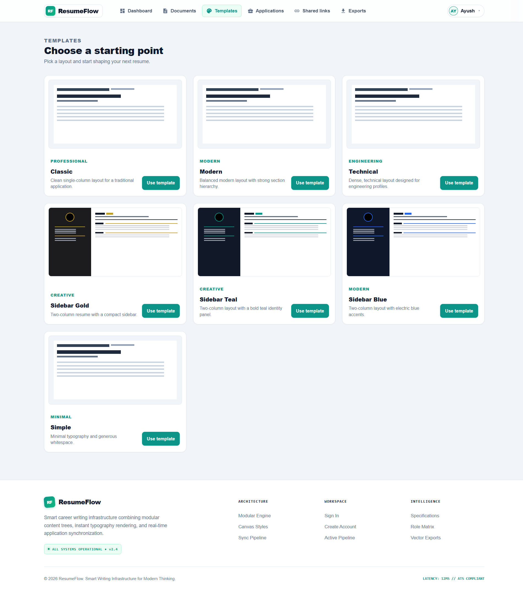
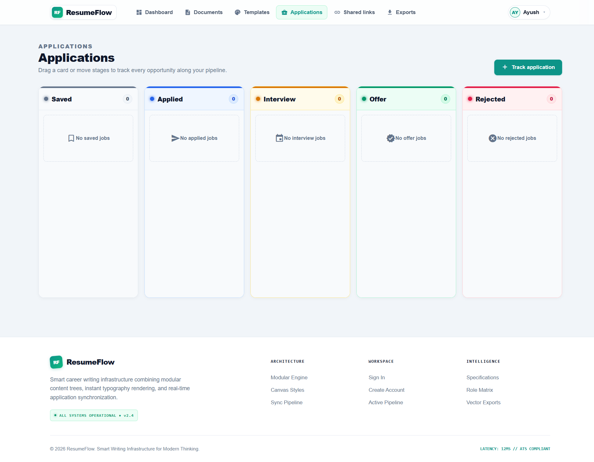
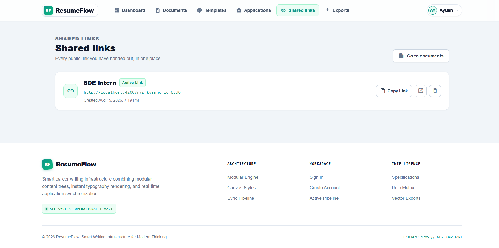
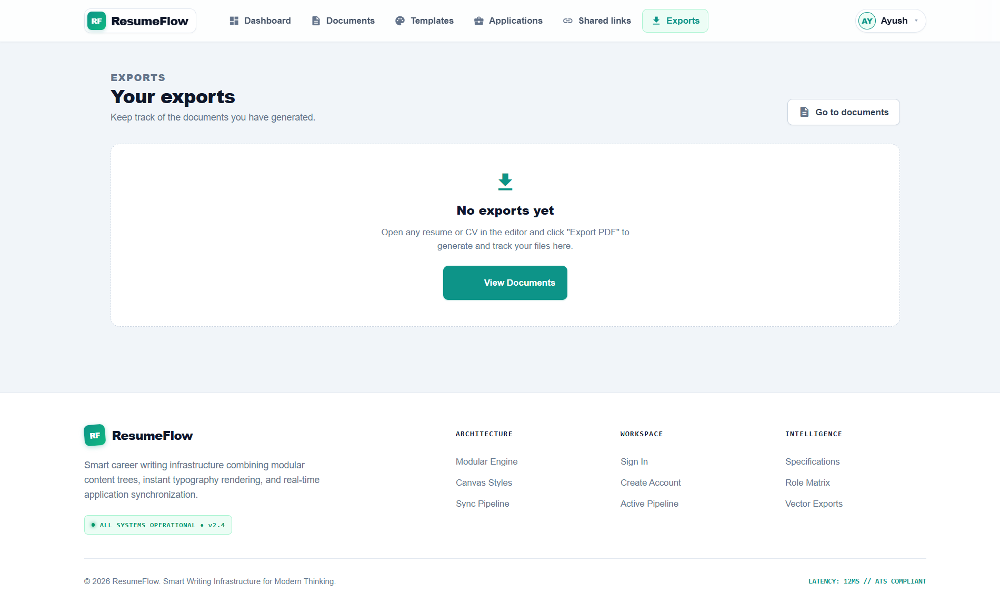

# ResumeFlow

ResumeFlow is a full-stack resume management and job application tracking application. It provides a complete workflow for creating and managing resumes, editing resume sections, using templates, maintaining document versions, tracking job applications, sharing resumes, and exporting resume data.

The project is divided into two major parts:

* **Frontend:** Angular application
* **Backend:** Node.js + Express REST API

---

## Project Structure

```text
ResumeFlow/
│
├── README.md
│
├── resume-flow/                    # Angular Frontend
│
└── resume-api/                     # Node.js / Express Backend
```

---

# 1. Frontend — `resume-flow`

The frontend is built using **Angular 13** and follows an **NgModule-based Angular architecture**.

### Frontend Technologies

* Angular 13
* TypeScript
* Angular Router
* Angular Forms
* Angular Material
* Angular CDK
* RxJS
* SCSS
* Jasmine
* Karma

The frontend package includes Angular Core, Router, Forms, Material, CDK and RxJS dependencies.

---

## Frontend Structure

```text
resume-flow/
│
├── angular.json
├── package.json
├── package-lock.json
├── tsconfig.json
├── tsconfig.app.json
├── tsconfig.spec.json
├── karma.conf.js
├── README.md
├── .gitignore
│
└── src/
    │
    ├── index.html
    ├── main.ts
    ├── polyfills.ts
    ├── styles.scss
    │
    ├── environments/
    │   ├── environment.ts
    │   └── environment.prod.ts
    │
    └── app/
        │
        ├── app.component.ts
        ├── app.component.html
        ├── app.component.scss
        ├── app.module.ts
        ├── app-routing.module.ts
        │
        ├── components/
        ├── core/
        └── pages/
```

---

# Frontend Core Files

## `app.module.ts`

The main Angular module of the application.

It is responsible for registering:

* Components
* Services
* Angular modules
* Forms modules
* Material modules
* Application-level dependencies

ResumeFlow uses an **NgModule-based architecture rather than standalone Angular components**.

---

## `app-routing.module.ts`

Contains application routing.

It connects URLs with their corresponding Angular pages/components.

Routing is used to navigate between:

* Landing page
* Login
* Sign up
* Dashboard
* Documents
* Editor
* Applications
* Templates
* Profile
* Shares
* Exports
* Public resume view
* Change password

---

# Frontend Components

The `components/` directory contains reusable UI sections, mainly used across the landing/public-facing experience.

```text
components/
│
├── app-navbar/
├── navbar/
├── hero/
├── features/
├── how-it-works/
├── stats/
├── templates/
├── testimonials/
├── faq/
├── cta/
└── footer/
```

Each component generally contains:

```text
component-name/
├── component-name.component.ts
├── component-name.component.html
├── component-name.component.scss
└── component-name.component.spec.ts
```

---

## `app-navbar`

Application-level navigation component.

Used for navigation within the application interface.

---

## `navbar`

Landing/public navigation bar.

Provides navigation links for the public-facing website.

---

## `hero`

Hero section of the ResumeFlow landing page.

Introduces ResumeFlow and provides the primary call-to-action.

---

## `features`

Displays the major features provided by ResumeFlow.

---

## `how-it-works`

Explains the ResumeFlow workflow to users.

---

## `stats`

Displays application/product statistics on the landing page.

---

## `templates`

Displays resume template-related content.

---

## `testimonials`

Displays user testimonials/social-proof content.

---

## `faq`

Contains frequently asked questions.

---

## `cta`

Call-to-action section used to encourage users to start using ResumeFlow.

---

## `footer`

Common footer section for the application/landing page.

---

# Frontend Core Layer

The `core/` directory contains application-wide logic that is reused across pages.

```text
core/
│
├── guards/
│   └── auth.guard.ts
│
├── interceptors/
│   └── auth.interceptor.ts
│
└── services/
    ├── app-data.service.ts
    ├── auth.service.ts
    ├── dashboard.service.ts
    └── document.service.ts
```

---

# Guards

## `auth.guard.ts`

Angular route guard responsible for protecting authenticated routes.

It prevents unauthorized users from accessing pages that require authentication.

---

# Interceptors

## `auth.interceptor.ts`

Angular HTTP interceptor responsible for handling authentication information on outgoing HTTP requests.

It is used to integrate frontend requests with the authentication mechanism provided by the backend.

---

# Services

## `auth.service.ts`

Responsible for frontend authentication-related operations.

Typical responsibilities include:

* Login
* Registration
* Authentication state
* Token handling
* Logout
* User authentication information

---

## `document.service.ts`

Handles frontend communication related to resume/document operations.

Used for operations such as:

* Fetching documents
* Creating documents
* Updating documents
* Deleting documents
* Working with document data

---

## `dashboard.service.ts`

Handles dashboard-related API communication and data.

It provides information required by the dashboard such as:

* Document information
* Application information
* Version information
* Export information
* Recent documents
* Application status information

---

## `app-data.service.ts`

Provides application-level/shared data functionality used by different parts of the frontend.

---

# Frontend Pages

The `pages/` directory contains the major application screens.

```text
pages/
│
├── landing/
├── login/
├── sign-up/
├── dashboard/
├── document/
├── editor/
├── applications/
├── templates/
├── exports/
├── shares/
├── public-view/
├── profile/
└── change-password/
```

---

# Landing Page

## `landing/`

The public landing page of ResumeFlow.

It brings together the landing-page components such as:

* Navbar
* Hero
* Features
* How It Works
* Stats
* Templates
* Testimonials
* FAQ
* CTA
* Footer

---

# Authentication Pages

## `login/`

Provides the user login interface.

---

## `sign-up/`

Provides new-user registration.

---

## `change-password/`

Provides password-change functionality for authenticated users.

---

# Dashboard

## `dashboard/`

The main authenticated user dashboard.

The dashboard provides an overview of the user's ResumeFlow activity.

It can display information such as:

* User information
* Resume/document count
* Application count
* Version count
* Export count
* Recent documents
* Application status distribution
* Pipeline progress

---

# Document Page

## `document/`

Responsible for displaying and managing an individual resume/document.

---

# Editor

## `editor/`

Provides the resume editing interface.

The editor is responsible for working with resume content and its sections/items.

---

# Applications

## `applications/`

Provides job application tracking functionality.

Users can manage application-related information such as:

* Company
* Position
* Application status
* Application date
* Related resume/document information

---

# Templates

## `templates/`

Provides resume template selection and template-related functionality.

---

# Exports

## `exports/`

Provides access to resume/document export functionality.

---

# Shares

## `shares/`

Handles resume sharing functionality.

Users can manage resumes that are shared with others.

---

# Public View

## `public-view/`

Provides a public-facing view of a shared resume/document.

This allows a resume to be viewed without accessing the private application dashboard.

---

# Profile

## `profile/`

Provides user profile management.

---

# Frontend Testing

The frontend contains Angular/Jasmine/Karma test files alongside components and services.

Example:

```text
component.spec.ts
service.spec.ts
```

The Angular project provides:

```bash
npm test
```

for running frontend tests.

---

# 2. Backend — `resume-api`

The backend is a REST API built with:

* Node.js
* Express
* Sequelize
* MySQL
* JWT
* bcrypt
* Nodemailer
* CORS
* dotenv

The backend requires **Node.js 18 or higher**.

---

## Backend Structure

```text
resume-api/
│
├── app.js
├── package.json
├── package-lock.json
├── .env
├── .gitignore
├── Procfile
├── railway.json
│
├── config/
├── controllers/
├── middleware/
├── migrations/
├── models/
├── routes/
├── seeders/
├── utils/
├── tests/
└── postman/
```

> `.env` contains environment-specific secrets/configuration and should not be committed to GitHub.

---

# Backend Entry Point

## `app.js`

The main entry point of the backend application.

It is responsible for setting up the Express server and connecting the different backend modules.

The application exposes the REST API through the route system.

---

# Backend Config

## `config/`

```text
config/
└── config.js
```

Contains database/application configuration used by Sequelize and the backend.

---

# Controllers

The `controllers/` directory contains the main business logic of the API.

```text
controllers/
│
├── aiController.js
├── applicationController.js
├── atsTailorExportController.js
├── authController.js
├── documentController.js
├── itemController.js
├── sectionController.js
├── shareController.js
├── templateController.js
├── userController.js
└── versionController.js
```

---

## `authController.js`

Handles authentication-related business logic.

Responsibilities include:

* User registration
* Login
* Password-related operations
* Authentication/token generation
* Authentication-related validation

---

## `userController.js`

Handles user profile and user-related operations.

---

## `documentController.js`

Main controller for resume/document management.

Handles operations related to:

* Creating documents
* Fetching documents
* Fetching individual documents
* Updating documents
* Deleting documents
* Managing document content
* Document-related operations

---

## `sectionController.js`

Handles resume sections.

Examples of resume sections include:

* Personal information
* Education
* Experience
* Projects
* Skills
* Other resume sections

---

## `itemController.js`

Handles individual items inside resume sections.

---

## `templateController.js`

Handles resume template-related operations.

---

## `versionController.js`

Handles resume version management.

Supports functionality such as:

* Creating/saving versions
* Fetching versions
* Restoring previous versions

---

## `applicationController.js`

Handles job application tracking.

Manages information associated with applications and their statuses.

---

## `shareController.js`

Handles resume sharing functionality.

---

## `aiController.js`

Handles AI-related API functionality.

---

## `atsTailorExportController.js`

Handles ATS-tailoring/export-related functionality.

---

# Middleware

```text
middleware/
│
├── auth.js
├── documentValidator.js
└── rateLimit.js
```

---

## `auth.js`

Authentication middleware.

Used to protect routes that require an authenticated user.

It works with the application's authentication/token mechanism.

---

## `documentValidator.js`

Validates incoming document-related request data before it reaches the controller.

---

## `rateLimit.js`

Provides request-rate limiting protection for API endpoints.

This helps prevent excessive requests to protected API functionality.

---

# Models

The `models/` directory contains Sequelize database models.

```text
models/
│
├── index.js
├── user.js
├── template.js
├── document.js
├── section.js
├── item.js
├── version.js
├── application.js
├── share.js
└── export.js
```

---

## `user.js`

Represents application users.

---

## `template.js`

Represents resume templates.

---

## `document.js`

Represents resume/document records.

---

## `section.js`

Represents sections belonging to documents.

---

## `item.js`

Represents individual content items inside sections.

---

## `version.js`

Represents saved versions/snapshots of resume documents.

---

## `application.js`

Represents tracked job applications.

---

## `share.js`

Represents shared resume/document records.

---

## `export.js`

Represents export-related records.

---

## `models/index.js`

Initializes Sequelize models and their relationships/associations.

---

# Database Migrations

The `migrations/` directory contains Sequelize database schema migrations.

```text
migrations/
│
├── create-user
├── create-template
├── create-document
├── create-section
├── create-item
├── create-version
├── create-application
├── create-share
├── create-export
│
├── add-is-sidebar-to-sections
├── add-cv-document-type
└── add-application-date-and-indexes
```

Migrations are used to create and update the MySQL database schema in a controlled and repeatable way.

---

# Seeders

```text
seeders/
└── 20260815000001-default-templates.js
```

The seeder provides default resume templates for the application.

Run seeders with:

```bash
npm run db:seed
```

---

# Routes

The backend uses Express routers to expose REST API endpoints.

```text
routes/
│
├── index.js
├── auth.js
├── user.js
├── documents.js
├── section.js
├── item.js
├── template.js
├── share.js
├── version.js
├── application.js
├── ai.js
└── export.js
```

The main router connects the API resources under these paths:

```text
/auth
/users
/documents
/sections
/items
/templates
/shares
/versions
/applications
/ai
/export
/exports
```

The `/export` and `/exports` paths are both connected to the export router.

---

# API Resource Overview

| Resource        | Purpose                           |
| --------------- | --------------------------------- |
| `/auth`         | Authentication and account access |
| `/users`        | User/profile operations           |
| `/documents`    | Resume/document management        |
| `/sections`     | Resume section management         |
| `/items`        | Section item management           |
| `/templates`    | Resume templates                  |
| `/shares`       | Resume sharing                    |
| `/versions`     | Resume version history            |
| `/applications` | Job application tracking          |
| `/ai`           | AI-related functionality          |
| `/export`       | Resume export                     |
| `/exports`      | Export route alias                |

---

# Utilities

```text
utils/
│
├── controllerError.js
├── documentData.js
└── validation.js
```

---

## `controllerError.js`

Provides reusable controller error-handling functionality.

---

## `documentData.js`

Contains document-related data/helper functionality used by the backend.

---

## `validation.js`

Contains reusable validation functionality.

---

# Tests

The backend contains automated tests under:

```text
tests/
│
├── app.test.js
├── models.test.js
├── rateLimit.test.js
└── validation.test.js
```

The backend test command is:

```bash
npm test
```

The configured test script runs all four test files.

---

# Postman

The project also contains Postman-related resources:

```text
postman/
```

and:

```text
.postman/
```

These can be used for API testing and development.

---

# Deployment

The backend contains deployment-related configuration:

```text
Procfile
railway.json
```

These files provide deployment configuration for hosting the backend.

---

# Environment Variables

The backend uses environment variables through `dotenv`.

Create a `.env` file inside:

```text
resume-api/
```

Example structure:

```env
DB_HOST=your_database_host
DB_PORT=3306
DB_NAME=your_database_name
DB_USER=your_database_user
DB_PASSWORD=your_database_password

JWT_SECRET=your_jwt_secret

PORT=3000
```

Use the actual variable names required by `config/config.js` and `app.js`.

**Never commit real database passwords, JWT secrets, API keys, or other credentials.**

---

# Running the Project

## 1. Clone the Repository

```bash
git clone https://github.com/AyushThinks/ResumeFlow.git
cd ResumeFlow
```

---

# 2. Run Backend

Open a terminal:

```bash
cd resume-api
```

Install dependencies:

```bash
npm install
```

Configure the `.env` file.

Run database migrations:

```bash
npm run db:migrate
```

Seed default templates:

```bash
npm run db:seed
```

Start the backend:

```bash
npm start
```

For development:

```bash
npm run dev
```

---

# 3. Run Frontend

Open another terminal from the repository root:

```bash
cd resume-flow
```

Install dependencies:

```bash
npm install
```

Start Angular:

```bash
npm start
```

The Angular development server will start the frontend application.

---

# Development Workflow

```text
User
  │
  ▼
Angular Frontend
  │
  │ HTTP Requests
  ▼
Express REST API
  │
  ├── Authentication Middleware
  ├── Validation Middleware
  ├── Rate Limiting
  │
  ▼
Controllers
  │
  ▼
Sequelize Models
  │
  ▼
MySQL Database
```

---

# Main Application Flow

```text
Registration / Login
        │
        ▼
Authentication
        │
        ▼
Dashboard
        │
        ├── Create Resume
        │       │
        │       ▼
        │    Document
        │       │
        │       ├── Sections
        │       │      │
        │       │      └── Items
        │       │
        │       └── Versions
        │
        ├── Templates
        │
        ├── Applications
        │
        ├── Shares
        │
        └── Exports
```

---

# Key Features

## Resume Management

* Create resumes/documents
* Update resume content
* Delete documents
* Manage resume sections
* Manage individual resume items

## Resume Templates

* Browse templates
* Use templates for resume creation
* Default templates through database seeders

## Resume Versioning

* Save resume versions
* View version history
* Restore previous versions

## Job Application Tracking

* Create job applications
* Track application status
* Track application dates
* View application progress

## Resume Sharing

* Share resumes
* Manage shared resumes
* Provide public resume viewing

## Export

* Resume export functionality
* Export-related tracking

## Authentication

* User registration
* Login
* Authentication-protected routes
* Password management
* JWT-based authentication

## Security

* Password hashing with bcrypt
* JWT authentication
* Authentication middleware
* Request validation
* Rate limiting
* Environment-based secrets

---

## Screenshots

### Landing Page


### Dashboard


### Document Editor


### Templates


### Job Application Tracking


### Shared Resume Links


### Exports


---

# Technology Stack

## Frontend

```text
Angular 13
TypeScript
Angular Router
Angular Forms
Angular Material
Angular CDK
RxJS
SCSS
Jasmine
Karma
```

## Backend

```text
Node.js
Express.js
Sequelize
MySQL
JWT
bcrypt
Nodemailer
CORS
dotenv
Sequelize CLI
```

---

# Repository Architecture

```text
ResumeFlow/
│
├── resume-flow/
│   │
│   ├── components/
│   ├── core/
│   │   ├── guards/
│   │   ├── interceptors/
│   │   └── services/
│   │
│   ├── pages/
│   │   ├── landing/
│   │   ├── login/
│   │   ├── sign-up/
│   │   ├── dashboard/
│   │   ├── document/
│   │   ├── editor/
│   │   ├── applications/
│   │   ├── templates/
│   │   ├── exports/
│   │   ├── shares/
│   │   ├── public-view/
│   │   ├── profile/
│   │   └── change-password/
│   │
│   └── environments/
│
└── resume-api/
    │
    ├── config/
    ├── controllers/
    ├── middleware/
    ├── migrations/
    ├── models/
    ├── routes/
    ├── seeders/
    ├── tests/
    ├── utils/
    └── postman/
```

---

# Git Structure

Both applications are maintained inside the same Git repository:

```text
ResumeFlow
│
├── resume-flow/       # Frontend
└── resume-api/        # Backend
```

This allows the complete ResumeFlow project to be version-controlled in one repository while keeping the frontend and backend logically separated.

---

# Author

**Ayush**

GitHub:

https://github.com/AyushThinks
